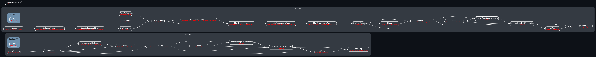

# Bevy基础渲染 (0.13)

**随便写的前言:** 关于Bevy渲染的资料可谓又少又过时，本人遂分享一下我所知道的关于Bevy渲染的一切。同时这也是我第一次写这种文章，肯定有很多不足，欢迎指正补充！

另外，请注意本文中使用的词语：“只能，必须，一定” 和 “可以”

还有，这里的一章一章不是说这一章的内容就是章标题，这个标题只能算是一个示例吧，是这章的一部分。

## 第一章 自定义材质

首先，材质需要继承/实现
- `Asset`因为材质本身是一种资产
- `AsBindGroup`因为材质的数据是需要绑定给Shader的
- `Material`/`Material2d`因为你要指定这个材质适用的Shader，或者自定义渲染管线，有点像Unity里面把Shader拖动给材质的意思。

### 什么是BindGroup？

我们任意打开一个Shader，例如`bevy_sprite/src/render/sprite.wgsl`:

```rust
#ifdef TONEMAP_IN_SHADER
#import bevy_core_pipeline::tonemapping
#endif

#import bevy_render::{
    maths::affine_to_square,
    view::View,
}

// ===================
// 其中，这里的group就是BindGroup的索引，binding就是这个数据在这个BindGroup中的索引
// ===================
@group(0) @binding(0) var<uniform> view: View;

...

// ===================
// 同理，这里也是
// ===================
@group(1) @binding(0) var sprite_texture: texture_2d<f32>;
@group(1) @binding(1) var sprite_sampler: sampler;

...
```

### BindGroup可以承载哪些数据？

我们可以通过查看`AsBindGroup`这个过程宏(proc-macro)的实现来得到答案：

```rust
#[proc_macro_derive(
    AsBindGroup,
    attributes(uniform, storage_texture, texture, sampler, bind_group_data, storage)
)]
pub fn derive_as_bind_group(input: TokenStream) -> TokenStream {
    let input = parse_macro_input!(input as DeriveInput);

    as_bind_group::derive_as_bind_group(input).unwrap_or_else(|err| err.to_compile_error().into())
}
```

可以看到它支持`uniform`, `storage_texture`, `texture`, `sampler`, `storage`，这个`bind_group_data`我们暂时不管，因为它不是BindGroup承载的数据，我们待会介绍。

值得注意的是，Wgsl不止支持这些类型，更多类型我们一会会讲到。

#### `uniform`和`storage`

这二者都是缓冲区(buffer)，它们都可以承载例如`i32`之类的primitive type或者你自定义的结构体，并且都可以设置dynamic offset（待会介绍）。区别在于`uniform`一次**只能**承载**一个只读**的东西，比如上面`sprite.wgsl`中的`View`，而`storage`**可以**一次承载**一个或多个(array)只读/只写/读写**的东西。

#### `storage_texture`, `texture`和`sampler`

这三者都与材质有关，两个带texture的都是材质（这不废话嘛），`sampler`是**只能在Fragment阶段使用的**采样器（待会详细介绍）。两个材质的区别在于，`storage_texture`可以读写，不能使用`sampler`采样，而`texture`只读，**可以**使用`sampler`采样。

### 如何使用 `AsBindGroup`？

其实`StandardMaterial`已经覆盖几乎所有用法了。基本上就是在对应类型的数据上面加对应的attr。

| Attr                 | Wgsl示例                                                 | Rust类型                                                                                                       | 含义                                                                                  | 额外说明                                                                         |
| -------------------- | -------------------------------------------------------- | -------------------------------------------------------------------------------------------------------------- | ------------------------------------------------------------------------------------- | -------------------------------------------------------------------------------- |
| `uniform(x)`         | `var<uniform> data: TheTypeOfx`                          | 任意实现了`ShaderType`的数据                                                                                   | 将这个数据绑定到`binding(x)`                                                          | 这个在`StandardMaterial`里面没有用到，可以看`examples/shader/shader_material.rs` |
| `uniform(x, Type)`   | `var<uniform> data: Type`                                | 任意实现了`ShaderType`的数据                                                                                   | 将这个材质里剩下的数据打包成`Type`并绑定到`binding(x)`                                | 这个就是`StandardMaterial`里面的用法                                             |
| `texture(x)`         | `var texture: texture_2d<f32>`                           | `Handle<Image>`或者`Option<Handle<Image>>`                                                                     | 绑个材质到`binding(x)`                                                                | 无                                                                               |
| `storage_texture(x)` | `var texture: texture_storage_2d<rgba8unorm, read_only>` | 同`texture`                                                                                                    | 以只读的方式绑个`rgba8unorm`格式（Bevy默认的格式）的`storage_texture`，到`binding(x)` | 无                                                                               |
| `sampler(x)`         | `var texture_sampler: sampler`                           | 没有对应的Rust类型，因为这个attr要加在你要使用这个采样器的材质的那个成员变量上面（表达的不太好建议直接看例子） | 绑个采样器到`binding(x)`                                                              | 无                                                                               |

完整示例：

```rust
#[derive(Asset, AsBindGroup, TypePath)]
struct MyMaterial {
    #[uniform(0)]
    pub color: Color,

    #[texture(
        1,
        dimension = "2d",
        sample_type = "float",
        multisampled = true,
        filterable = true
    )]
    #[sampler(2, sampler_type = "filtering")]
    pub texture: Option<Handle<Image>>,

    #[storage_texture(3, dimension = "2d")]
    pub storage_texture: Handle<Image>,

    #[storage(4, read_only, buffer)]
    pub buffer: Buffer,
}
```

可以看到除了表格里面列的，还有很多额外的设置，这些我们之后会讲。如果你对这些attr的意思了解，那么你完全可以随便写个错误的attr：`#[texture(0, aaa)]`，Bevy的文档做的很全面，所以它会报错并且提示你哪些是可用的。

## 第二章 后处理

这一章内容可能会有点多，*请坐稳扶好*。

### Shader准备

Shader部分随便写一个吧，把屏幕颜色转换成灰度并且随时间闪烁

```rust
#import bevy_core_pipeline::fullscreen_vertex_shader::FullscreenVertexOutput
#import bevy_render::globals::Globals

struct Settings {
    speed: f32,
}

@group(0) @binding(0)
var main_tex: texture_2d<f32>;

@group(0) @binding(1)
var main_tex_sampler: sampler;

@group(0) @binding(2)
var<uniform> settings: Settings;

@group(0) @binding(3)
var<uniform> globals: Globals;
// 这个Globals是Bevy自带的一个东西，包含time, delta_time, frame_count

@fragment
fn fragment(in: FullscreenVertexOutput) -> @location(0) vec4f {
    let color = textureSample(main_tex, main_tex_sampler, in.uv).rgb;
    let gray = color.r * 0.299 + color.g * 0.587 + color.b * 0.114;
    return vec4f(gray, gray, gray, 1.) * sin(globals.time * settings.speed);
}

```

`FullscreenVertexOutput`是Bevy帮你算好了屏幕uv之后的输出，因为Bevy的后处理本质上是在摄像机前面糊一个三角面片，这里可以看`assets/shader/post_processing.wgsl`中的介绍：

```rust
// This shader computes the chromatic aberration effect

// Since post processing is a fullscreen effect, we use the fullscreen vertex shader provided by bevy.
// This will import a vertex shader that renders a single fullscreen triangle.
//
// A fullscreen triangle is a single triangle that covers the entire screen.
// The box in the top left in that diagram is the screen. The 4 x are the corner of the screen
//
// Y axis
//  1 |  x-----x......
//  0 |  |  s  |  . ´
// -1 |  x_____x´
// -2 |  :  .´
// -3 |  :´
//    +---------------  X axis
//      -1  0  1  2  3
//
// As you can see, the triangle ends up bigger than the screen.
//
// You don't need to worry about this too much since bevy will compute the correct UVs for you.
```

接下来我们把这个Shader加载进Bevy：

```rust
// 这串数字随便滚的，别和别的重复就好
const SHADER_HANDLE: Handle<Shader> = Handle::weak_from_u128(4564131856740218563412);

...
impl Plugin for Chapter2Plugin {
    fn build(&self, app: &mut App) {
        // 这是一个加载Bevy内部资源的宏，也许你已经知道了使用AssetServer加载资源，那这里就是另一种。
        load_internal_asset!(app, SHADER_HANDLE, "monochromer.wgsl", Shader::from_wgsl);
    }
}
```

实际上在Bevy0.12的时候加了个`embedded_asset!`宏，~~但是它对于文件路径的处理有一些问题，见[这个issue](https://github.com/bevyengine/bevy/issues/10377)~~ 哎我去0.13修好了？？~~咳咳，那你们自己研究一下吧，我也才刚刚知道（逃）~~

### 数据准备

我们创建一个用于控制速度的Component，装在相机上来控制每一个相机：

```rust
#[derive(Component, ExtractComponent, ShaderType, Clone)]
pub struct MonochromerSettings {
    pub speed: f32,
}
```

> *哎，这里的`ExtractComponent`是干什么的？*

~~感谢这位网友的提问~~，为什么要`Extract`呢？因为Bevy的渲染和模拟（也就是你在ECS里面干的事情，比如旋转个物体什么的）是分开的。在渲染之前，Bevy会把所有用于渲染的数据复制到Render World。对，Bevy内部有两个World，它们的数据是不共享的。那么既然有`ExtractComponent`，也就有`ExtractResource`了。

实现`ExtractComponent`之后，这个Resource就可以被Bevy的一个插件`ExtractComponentPlugin`给自动提取进Render World了。（`ExtractResource`同理）。

此外，也有`ExtractInstancesPlugin`，只不过你要单独开一个类似于`Bundle`的结构体来描述这个Instance，然后derive`ExtractInstance`。

好，那我们加上这个插件：

```rust
app.add_plugins(ExtractComponentPlugin::<MonochromerSettings>::default());
```

现在，数据已经进入了Render World，我们接下来就是要让它进入GPU。还记得第一章介绍的几种数据吗？我们这里用Uniform缓冲区(Uniform Buffer)，所以上面还derive了`ShaderType`。Bevy同样提供了插件：

```rust
app.add_plugins((
    ExtractComponentPlugin::<MonochromerSettings>::default(),
    UniformComponentPlugin::<MonochromerSettings>::default(),
));
```

这个数据会被存储到一个`ComponentUniforms`的Resource的buffer里面，通过dynamic offset的方式获取到我们想要的那个uniform。

听不懂了？来看图：

这是一个Uniform Buffer，其中存储了一些数据，我们假设一条`-`表示4个字节，并且其中的第二个方块的位置就是我们想要的`MonochromerSettings`。

```text
+----+----+-------+------+----+----+
|    |    |       |      |    |    |
+----+----+-------+------+----+----+
```

第一章我们说过，Uniform只能承载一个东西，也就是一个方块，那么直接把整个buffer丢进去，默认只会拿到第一个。这时就需要dynamic offset了，这个offset填在哪里我们待会会说。通过这个数字，我们可以准确地让Shader知道我们的数据存在哪里，比如在这里的假设中的dynamic offset就应该填16来偏移到第二个方块。

注意，方块是假象出来的，实际上的缓冲区只有一堆1和0，Shader通过类型来判断在offset过后需要读取几位数据。

这个dynamic offset会由Bevy自动以`DynamicUniformIndex<T>`的形式加到对应的Entity上面，在我们这个例子里，就是把`DynamicUniformIndex<MonochromerSettings>`加在对应的摄像机上，渲染的时候可以直接拿到。

> *那我想用Resource来存储这个设置怎么办？好像没有`UniformResourcePlugin`这种东西啊*

确实，Bevy没有提供这种东西（据我所知），那么关于这个问题，我们待会会讲到。

### 渲染

Bevy中的渲染流程是由一个叫Render Graph的东西控制的，它定义了每一个Graph Node的执行顺序，比如下面这张图就是0.13.0的默认Render Graph。


> 如果你也想要生成这张图，你可以下载`bevy_mod_debugdump`这个crate，使用很简单，看一下README就会了。把这个crate输出的内容复制，然后粘贴到[这个网站](https://dreampuf.github.io/GraphvizOnline/)里面，就可以把dot格式的文字变成上面这样的图片。

可以看到上面有很多很多Node，并且有两个大的框框，上面写着`Core2d`和`Core3d`，也就是一个是给2d相机用的，一个是3d相机，这章接下来的内容以2d相机为例，3d相机的作为补充写在括号里。

既然想要做后处理，那么必然要在渲染完成之后再执行，也就是图中的`MainPass`(`EndMainPass`)之后。我们可以看到，Bevy已经提供了几个后处理，比如`Bloom`，再看`Bloom`下面的Node名字，叫`ViewNodeRunner<BloomNode>`。哎！没错，我们也要创建一个自己的`MonochromerNode`来执行我们的后处理，并且实现`ViewNode`trait，这样就可以被`ViewNodeRunner<T>`驱动了。

```rust
impl ViewNode for MonochromerNode {
    type ViewQuery = (
        Read<ViewTarget>,
        Read<DynamicUniformIndex<MonochromerSettings>>,
    );

    fn run<'w>(
        &self,
        graph: &mut RenderGraphContext,
        render_context: &mut RenderContext<'w>,
        (view_target, uniform_offset): QueryItem<'w, Self::ViewQuery>,
        world: &'w World,
    ) -> Result<(), NodeRunError> {
        todo!()
    }
}
```

> *这个总是提到的`View`是什么意思？*

在目前你可以认为就是摄像机，但是实际上，在3d游戏中，灯光也是View。因为会投射阴影的灯光需要预先渲染一张Shadow Map，你可以想象成把一台摄像机架在灯光的位置拍几张照片。

好，我们回到`ViewNode`的实现。我们注意到这个trait里面包含了一个类型叫`ViewQuery`，也就是在View上面做的Query。还记得上面我们添加的`UniformComponentPlugin`插件吗？它会把那个dynamic offset的Component挂在View（摄像机）上面，我们现在给它Query下来。这里加`Read<T>`是因为在渲染时，Render World是只读的。`ViewTarget`的作用你马上就知道了。

接下来我们来实现一下这个`run()`。首先明确一下我们要干什么：
- 把摄像机渲染到的东西拿下来绑定Shader做后处理
- 把已经在GPU端的uniform数据绑定给对应的Shader
- 渲染之前说到的覆盖在摄像机前面的三角面片

在正式绑定数据之前，我们其实还需要让GPU知道该怎么绑定，也就是创建一个Layout。这个Layout会被放在渲染管线里面。那我们接下来先创建这个渲染管线(Render Pipeline)：

> 我去，突然塞给我这么多代码你要干嘛？？！！

别急，看注释

```rust
// 这个纯属个人喜好
use bevy::render::render_resource::binding_types as binding;

...

#[derive(Resource)]
pub struct MonochromerPipeline {
    // 代表了GPU端的这个管线的id
    cached_id: CachedRenderPipelineId,
    // 这个就是告诉GPU如何绑定我们的数据，和Shader里面的@group(x)相对应
    layout: BindGroupLayout,
    // 用来采样用于后处理的图像，就是采样摄像机渲染完的结果
    sampler: Sampler,
}

impl FromWorld for MonochromerPipeline {
    fn from_world(world: &mut World) -> Self {
        let render_device = world.resource::<RenderDevice>();

        // 实际上这里的BindGroupLayoutEntries是Bevy提供的工具类，你可以按照wgpu的方式自己写，
        // 不过wgpu的表达太罗嗦了，没有必要，此处不做进一步介绍
        let layout = render_device.create_bind_group_layout(
            "monochromer_layout",
            &BindGroupLayoutEntries::sequential(
                // 除了Fragment之外，还有Vertex和Compute，表示了这个绑定组在哪些阶段可以被Shader使用
                ShaderStages::FRAGMENT,
                // 这里实际上就是对第一章的AsBindGroup的手动处理
                (
                    binding::texture_2d(TextureSampleType::Float { filterable: true }),
                    binding::sampler(SamplerBindingType::Filtering),
                    // true就表示我们启用dynamic offset
                    binding::uniform_buffer::<MonochromerSettings>(true),
                    binding::uniform_buffer::<GlobalsUniform>(false),
                ),
            ),
        );

        let sampler = render_device.create_sampler(&SamplerDescriptor {
            label: Some("monochromer_sampler"),
            // 不管怎么样都使用Linear的模式
            min_filter: FilterMode::Linear,
            mag_filter: FilterMode::Linear,
            mipmap_filter: FilterMode::Linear,
            ..Default::default()
        });

        let cached_id =
            world
                .resource::<PipelineCache>()
                .queue_render_pipeline(RenderPipelineDescriptor {
                    label: Some("monochromer_pipeline".into()),
                    layout: vec![layout.clone()],
                    push_constant_ranges: vec![],
                    // 注意这个顶点阶段必须使用Bevy提供的这个
                    vertex: fullscreen_shader_vertex_state(),
                    primitive: PrimitiveState::default(),
                    depth_stencil: None,
                    multisample: MultisampleState::default(),
                    fragment: Some(FragmentState {
                        // 这个就是之前的那个handle
                        shader: SHADER_HANDLE,
                        // 这个是定义给Shader的宏
                        shader_defs: vec![],
                        // Fragment阶段的函数名称
                        entry_point: "fragment".into(),
                        targets: vec![Some(ColorTargetState {
                            // 因为我们要把渲染的结果还给摄像机，所以就用Bevy默认的格式就好
                            format: TextureFormat::bevy_default(),
                            blend: None,
                            write_mask: ColorWrites::ALL,
                        })],
                    }),
                });

        Self {
            cached_id,
            layout,
            sampler,
        }
    }
}
```

> *`shader_defs`到底是啥？你说的这三个语言我都没学过。*

你可以回到第一章的`sprite.wgsl`，如果你当时正在疑惑这一段代码是什么的话，此刻答案揭晓。这里的`TONEMAP_IN_SHADER`就是所谓的`shader_defs`，当你的管线没有定义`TONEMAP_IN_SHADER`时，下面这行`#import`就会被略过。

```rust
#ifdef TONEMAP_IN_SHADER
#import bevy_core_pipeline::tonemapping
#endif
```

> 啥叫`Linear`模式的采样？它和`Nearest`有什么区别？

`Linear`你可以理解成你采样的结果会是周围几个像素的加权平均值，也就是看起来会比较平滑。而`Nearest`则是直接采样最近像素的值，会很硬。如果你将要采样一幅像素画，那请务必使用`Nearest`模式。当然这里我们采样的是摄像机的渲染结果，因此用`Linear`会更合适。

> 这Sampler底下不是还有一堆东西嘛？那些是什么意思你怎么不讲？

~~我不会（小声）~~ 咳咳，这个，啊，`address_mode_u`和`address_mode_v`和`address_mode_w`可以调整当采样器采样到外面的时候该怎么办。其它的嘛，啊（眼神飘忽）啊，这个以后会说的，会说的

> 我一定要在这个管线创建的时候就`queue_render_pipeline`吗？万一我想针对不同的渲染物体做不同处理怎么办？

这当然是可以的，你可以实现`SpecializedRenderPipeline`之后在`RenderSet::Queue`阶段对这根管线做`specialize()`听不懂？这部分之后会讲，别急。

> 我在输入`queue_render_pipeline`的时候，还看到了`queue_compute_pipeline`，还有输`CachedRenderPipelineId`的时候看到了`CachedComputePipelineId`，这个ComputePipeline是什么？

这是计算管线，虽然它也会走一遍渲染流水线，但是不同于渲染管线，它使用的是计算着色器，可以做一些其他的特殊用途，我们之后会讲。

最后别忘记了，作为一个Resource，这个管线需要被`init_resource()`：

```rust
fn finish(&self, app: &mut App) {
    let render_app = app.sub_app_mut(RenderApp);
    render_app.init_resource::<MonochromerPipeline>();
}
```

小小4行代码，有不少注意点。首先，我们在`finish()`函数中，而不是`build()`，这是因为我们的管线用到了`RenderDevice`，它也在`build()`里被初始化，如果我们的管线也在`build()`时初始化可能会出错。接下来，我们在`render_app`里调用的`init_resource`而不是`app`，还记得你之前看到的什么Render World什么Extract什么的吗？这个`render_app`你可以理解成是在Render World中运行的app，它连接的是Render World。显然渲染管线只有在渲染时会用到，那么就没有必要初始化在模拟世界然后Extract。

说了这么多别的，我们再回到`run()`的实现：

```rust
fn run<'w>(
    &self,
    _graph: &mut RenderGraphContext,
    render_context: &mut RenderContext<'w>,
    (view_target, uniform_offset): QueryItem<'w, Self::ViewQuery>,
    world: &'w World,
) -> Result<(), NodeRunError> {
    let pipeline = world.resource::<MonochromerPipeline>();
    let Some(cached_pipeline) = world
        .resource::<PipelineCache>()
        .get_render_pipeline(pipeline.cached_id)
    else {
        return Ok(());
    };

    let settings = world.resource::<ComponentUniforms<MonochromerSettings>>();
    let globals = world.resource::<GlobalsBuffer>();

    // 此处表示开始后处理，有一个东西叫swap chain，就是说在屏幕背后有两张图像，
    // 一张是你正在看到的，另一张是在渲染的，渲染完成后它们互换，你就能直接看到渲
    // 染结果，从而避免了看到渲染的过程。那么这里就是手动互换它们，此时的source
    // 就是渲染完成的结果，destination是即将呈现在屏幕上的内容，我们要拿到
    // source，对其使用后处理，再还给destiniation
    let post_process = view_target.post_process_write();

    let bind_group = render_context.render_device().create_bind_group(
        "monochromer_bind_group",
        &pipeline.layout,
        &BindGroupEntries::sequential((
            // 把渲染结果绑定
            post_process.source,
            &pipeline.sampler,
            // 绑定已经在GPU端的数据
            settings.binding().unwrap(),
            globals.buffer.binding().unwrap(),
        )),
    );

    let mut render_pass = render_context.begin_tracked_render_pass(RenderPassDescriptor {
        label: Some("monochromer_pass"),
        color_attachments: &[Some(RenderPassColorAttachment {
            view: &post_process.destination,
            resolve_target: None,
            ops: Operations::default(),
        })],
        ..Default::default()
    });

    render_pass.set_render_pipeline(cached_pipeline);
    // 看，这个uniform_offset.index()就是之前一直说的dynamic offset。
    // 如果你有多个带dynamic offset的buffer的话，你只要按照它们在Bind Group中的顺序，
    // 把它们对应的dynamic offset塞进这个array slice里面就好
    render_pass.set_bind_group(0, &bind_group, &[uniform_offset.index()]);
    // 表示绘制第[0, 3)个顶点，第[0, 1)个mesh示例，也就是渲染那块糊在摄像机前的三角面片
    render_pass.draw(0..3, 0..1);

    // Ok~
    Ok(())
}
```

不过如果你在这时`cargo run`的话，摄像机的输出是不会有任何改变的。还记得我上面介绍的Render Graph吗？我们的这个后处理Node还没有放进Graph里面，因此不会被调用，现在我们给它加进去：

```rust
fn build(&self, app: &mut App) {
    ...

    // 注意，我们在render_app里操作！！
    let render_app = app.sub_app_mut(RenderApp);

    render_app
        // 把这个Node用ViewNodeRunner<T>驱动，并且添加到Core2d这个Graph里面，以MonochromerNodeLabel表示MonochromerNode
        .add_render_graph_node::<ViewNodeRunner<MonochromerNode>>(Core2d, 
MonochromerNodeLabel)
        // 把这个Node连接进去，表示它在MainPass后面，Bloom前面执行。其实只要放在MainPass后面，EndMainPassPostProcessing前面就可以了，我这随便放的
        .add_render_graph_edges(
            Core2d,
            (Node2d::MainPass, MonochromerNodeLabel, Node2d::Bloom),
        );
}

#[derive(RenderLabel, Debug, Clone, PartialEq, Eq, Hash)]
pub struct MonochromerNodeLabel;

// 注意这里必须实现Default或者FromWorld
#[derive(Default)]
pub struct MonochromerNode;
```

> 这个ViewNodeRunner<T>是一定要的吗？我能不能给它去掉？

可以，不是必须的，**但是前提是**我们的`MonochromerNode`得是一个独立的`Node`而不是`ViewNode`！之后会讲嗒，别急。

最后，别忘了给你的摄像机加上`MonochromerSettings`：

```rust
commands.spawn((
    Camera2dBundle::default(),
    // 别调太高，伤眼睛（
    ch2_post_processing::MonochromerSettings { speed: 2. },
));
```

最后的最后，`cargo run`，你就会看到你的视野正在闪烁，~~是不是感觉快似了~~

如果此时你尝试输出Render Graph，你就会得到：



看到`MonochromerNodeLable`和`ViewNodeRunner<MonochomerNode>`了吗？那就是你努力的成果！

## 第三章 案例驱动的进一步认知

在这一章，我们会尝试做一个简单的Tilemap库。什么？你怎么知道我做过一个[Tilemap库](https://github.com/443eb9/bevy_entitiles)？（谁问你了）

### 启程前的准备

先来梳理一下我们到底要干什么
- 在App World（也就是之前提到的模拟世界）中对Tilemap创建，添加Tile，修改Tile，删除Tile（本文限于篇幅不讲修改和删除）
- 将Tilemap从App World提取进Render World
- 将Tilemap的渲染任务告知Bevy
- 准备Tilemap渲染所需要的资源
- 渲染Tilemap

所以这一章内容又超级多的，*请继续做稳扶好*

### App World

这里就比较简单了，我们只需要创建一些比较基本的组件什么的，我就不过多赘述了。

```rust
#[derive(Component, Clone, Copy)]
pub struct TilemapSlotSize(pub Vec2);

#[derive(Component, Clone)]
pub struct TilemapTexture {
    pub image: Handle<Image>,
    pub image_size: UVec2,
    pub tile_size: UVec2,
}

#[derive(Component)]
pub struct TilemapStorage {
    storage: Vec<Option<Entity>>,
    size: UVec2,
}

impl TilemapStorage {
    pub fn new(size: UVec2) -> Self {
        Self {
            storage: vec![None; (size.x * size.y) as usize],
            size,
        }
    }

    #[inline]
    pub fn set(&mut self, commands: &mut Commands, index: UVec2, tile: Tile) {
        self.storage[(index.y * self.size.x + index.x) as usize] =
            Some(commands.spawn((tile, TileIndex(index))).id());
    }
}

#[derive(Component, Default, Clone)]
pub struct TilemapAnimation {
    // fps frame1 frame2 frame3 fps frame1 frame2 ...
    pub(crate) buffer: Vec<u32>,
}

impl TilemapAnimation {
    pub fn add_animation(&mut self, anim: Vec<u32>, fps: u32) -> TileAnimation {
        self.buffer.push(fps);
        let start = self.buffer.len() as u32 - 1;
        let length = anim.len() as u32 - 1;
        self.buffer.extend(anim);
        TileAnimation { start, length }
    }
}

#[derive(Clone, Copy)]
pub enum TileTexture {
    Static(u32),
    Animated(TileAnimation),
}

#[derive(Clone, Copy)]
pub struct TileAnimation {
    start: u32,
    length: u32,
}

#[derive(Component)]
pub struct Tile {
    pub tilemap: Entity,
    pub texture: TileTexture,
    pub tint: Color,
}

#[derive(Component)]
pub struct TileIndex(pub UVec2);
```

其中值得注意的是，对于带有动画效果的Tile，我们采用的是一整个Buffer去存储所有的帧和帧率，这样Tile就只需要记录动画的起始位置和长度即可。

随后我们生成一张Tilemap：

```rust
impl Plugin for Chapter3Plugin {
    fn build(&self, app: &mut App) {
        app.add_systems(Startup, tilemap_setup);
    }
}

fn tilemap_setup(mut commands: Commands, asset_server: Res<AssetServer>) {
    let tilemap = commands.spawn_empty().id();
    let mut anim = TilemapAnimation::default();
    let mut storage = TilemapStorage::new(UVec2::splat(16));

    let sample_anim = anim.add_animation(vec![0, 1, 2, 3], 10);

    for x in 0..8 {
        for y in 0..8 {
            storage.set(
                &mut commands,
                UVec2 { x, y },
                Tile {
                    tilemap,
                    texture: TileTexture::Animated(sample_anim),
                    tint: Color::LIME_GREEN,
                },
            );
        }
    }

    for x in 8..16 {
        for y in 8..16 {
            storage.set(
                &mut commands,
                UVec2 { x, y },
                Tile {
                    tilemap,
                    texture: TileTexture::Static(2),
                    tint: Color::RED,
                },
            );
        }
    }

    commands.entity(tilemap).insert((
        // 这里其实最好用一个Bundle打包，我这里就懒得做了
        TilemapSlotSize(Vec2::splat(16.)),
        TilemapTexture {
            image: asset_server.load("tiles.png"),
            image_size: UVec2::splat(32),
            tile_size: UVec2::splat(16),
        },
        storage,
        anim,
    ));
}
```

### Extract

现在这个Tilemap已经存在于App World中了，如果要渲染，我们就需要把它Extract到Render World。也许你想要使用之前提到的`ExtractInstancePlugin`，但是它不允许我们在Extract的过程中做一些额外操作。因此我们这里使用自定义的Extract：

```rust
#[derive(Component)]
pub struct ExtractedTilemap {
    pub translation: Vec3,
    pub slot_size: TilemapSlotSize,
    pub animation: TilemapAnimation,
    pub texture: Option<TilemapTexture>,
}

#[derive(Component)]
pub struct ExtractedTile {
    pub tilemap: Entity,
    pub index: UVec2,
    pub texture: TileTexture,
    pub tint: Vec4,
}

pub fn extract_tilemaps(
    mut commands: Commands,
    // 注意这里的Extract<T>！！
    tilemaps_query: Extract<
        Query<(
            Entity,
            &TilemapSlotSize,
            &TilemapAnimation,
            Option<&TilemapTexture>,
            &GlobalTransform,
        )>,
    >,
) {
    commands.insert_or_spawn_batch(
        tilemaps_query
            .iter()
            .map(|(entity, slot_size, animation, texture, transform)| {
                (
                    entity,
                    ExtractedTilemap {
                        translation: transform.translation(),
                        slot_size: *slot_size,
                        animation: animation.clone(),
                        texture: texture.cloned(),
                    },
                )
            })
            .collect::<Vec<_>>(),
    )
}

pub fn extract_tiles(
    mut commands: Commands,
    tiles_query: Extract<
        Query<(Entity, &Tile, &TileIndex), Or<(Changed<Tile>, Changed<TileIndex>)>>,
    >,
) {
    commands.insert_or_spawn_batch(
        tiles_query
            .iter()
            .map(|(entity, tile, index)| {
                (
                    entity,
                    ExtractedTile {
                        tilemap: tile.tilemap,
                        index: index.0,
                        texture: tile.texture,
                        tint: tile.tint.rgba_linear_to_vec4(),
                    },
                )
            })
            .collect::<Vec<_>>(),
    );
}
```

> *为什么要用`insert_or_spawn_batch`而不能直接`spawn_batch`？*

方便在Render World中的查询。

> *为什么颜色要变成线性的？难道还有非线性的吗？*

因为Shader中的颜色叠加/混合/...都是在线性空间下进行的，因此这里要转换成线性的颜色。有，显示器显示的颜色就是非线性的。线性颜色会经过Gamma Correction再显示给你看，但这个过程不是我们需要操心的。

> *我每次都要提取一遍一整个`TilemapAnimation`不会很慢吗？*

一般不会，因为Rust速度快，而且这个缓冲区一般不会很大。如果你想要优化，可以创建一个存储`ExtractedTilemaps`的Resource，对于`TilemapAnimation`发生变更的Entity，我们整个提取并且存好，对于未发生改变的，我们只提取Entity本身，随后在`ExtractedTilemaps`里面获取到对应的数据。

> *那我要怎么访问Render World中的Entity/Resource啊？*

只需要去掉`Query<T>`或者`Res<T>`外面的`Extract<T>`就好。不过在`Extract`阶段一般是不访问Render World里面的Entity的。

随后我们把这两个系统注册进Bevy，注意是render_app并且Schedule叫`ExtractSchedule`。

```rust
fn build(&self, app: &mut App) {
    let render_app = app.sub_app_mut(RenderApp);

    render_app.add_systems(
        ExtractSchedule,
        (render::extract_tilemaps, render::extract_tiles),
    );
}
```

### Queue

好了，我们的Tilemap已经进去Render World了，下一步，我们要让Bevy知道我们要渲染这些Tilemap。那么这个过程，就叫`Queue`。

在Queue之前，我们要先创建一下渲染Tilemap的渲染管线：

```rust
#[derive(ShaderType)]
pub struct TilemapUniform {
    pub translation: Vec3,
    pub slot_size: Vec2,
}

#[derive(Resource)]
pub struct TilemapPipeline {
    pub layout: BindGroupLayout,
    pub linear_sampler: Sampler,
    pub nearest_sampler: Sampler,
}

impl FromWorld for TilemapPipeline {
    fn from_world(world: &mut World) -> Self {
        let render_device = world.resource::<RenderDevice>();

        let layout = render_device.create_bind_group_layout(
            "tilemap_layout",
            &BindGroupLayoutEntries::sequential(
                ShaderStages::VERTEX_FRAGMENT,
                (
                    binding::texture_2d(TextureSampleType::Float { filterable: true }),
                    binding::sampler(SamplerBindingType::Filtering),
                    binding::uniform_buffer::<TilemapUniform>(true),
                ),
            ),
        );

        let linear_sampler = render_device.create_sampler(&SamplerDescriptor {
            label: Some("tilemap_linear_sampler"),
            mag_filter: FilterMode::Linear,
            min_filter: FilterMode::Linear,
            mipmap_filter: FilterMode::Linear,
            ..Default::default()
        });

        let nearest_sampler = render_device.create_sampler(&SamplerDescriptor {
            label: Some("tilemap_linear_sampler"),
            mag_filter: FilterMode::Linear,
            min_filter: FilterMode::Linear,
            mipmap_filter: FilterMode::Linear,
            ..Default::default()
        });

        Self {
            layout,
            linear_sampler,
            nearest_sampler,
        }
    }
}
```

> *怎么这次没有直接`queue_render_pipeline`了？*

正如我前文所说，我们这里需要根据不同的Tilemap来给不同的`shader_defs`。有些Tilemap是不带颜色的，因此不需要采样材质，我们需要告诉Shader，

> *这个`TilemapUniform`是什么？*

和之前的那个`UniformComponentPlugin`的效果是差不多的，我们需要把Tilemap的相关信息告诉Shader，那么就需要这样一个类型来描述这张Tilemap。

> *为什么要两个Sampler？*

这两个Sampler对应两种`FilterMode`，我们根据不同的`FilterMode`选取不同的Sampler。`FilterMode`是什么前文已经说到过了。

最后别忘了init：

```rust
fn finish(&self, app: &mut App) {
    let render_app = app.sub_app_mut(RenderApp);

    render_app.init_resource::<TilemapPipeline>();
}
```

哎，聪明的你也许发现了，我前文说过，想要根据不同情况“定制”Pipeline，还需要调用`specialize()`方法，它属于`SpecializedRenderPipeline`。那我们现在实现一下：

```rust
#[derive(Clone, PartialEq, Eq, Hash)]
pub struct TilemapPipelineKey {
    pub msaa_sample_count: u32,
    pub has_texture: bool,
}

impl SpecializedRenderPipeline for TilemapPipeline {
    type Key = TilemapPipelineKey;

    fn specialize(&self, key: Self::Key) -> RenderPipelineDescriptor {
        todo!()
    }
}
```

这里的`Key`里的内容，就是表示这张Tilemap是否携带材质，以及MSAA的采样数。

接下来正式实现一下`specialize()`：

```rust
fn specialize(&self, key: Self::Key) -> RenderPipelineDescriptor {
    let mut shader_defs = vec![];
    if key.has_texture {
        // 这里的TEXTURED_TILEMAP就是之前所说的宏的关键字
        // 一会在Shader里面我们可以检测它是否被启用
        shader_defs.push("TEXTURED_TILEMAP".into());
    }

    // Mesh中每个顶点包含的信息
    let vertex_formats = vec![
        // tint 色调
        VertexFormat::Float32x4,
        // index 索引
        VertexFormat::Sint32x2,
        // texture_index 材质
        // If the y component is NOT -1, then this is a animated tile.
        // So we need to consider the x component as start and y as length
        // 如果y不是-1的话就说明这是块使用动画的Tile，此时这个数据的含义就变成的动画的起始索引和长度
        VertexFormat::Sint32x2,
    ];

    RenderPipelineDescriptor {
        label: Some("tilemap_pipeline".into()),
        layout: vec![self.layout.clone()],
        vertex: VertexState {
            shader: TILEMAP_SHADER,
            shader_defs: shader_defs.clone(),
            entry_point: "vertex".into(),
            buffers: vec![VertexBufferLayout::from_vertex_formats(
                VertexStepMode::Vertex,
                vertex_formats,
            )],
        },
        fragment: Some(FragmentState {
            shader: TILEMAP_SHADER,
            shader_defs,
            entry_point: "fragment".into(),
            targets: vec![Some(ColorTargetState {
                format: TextureFormat::bevy_default(),
                // 透明度混合
                blend: Some(BlendState::ALPHA_BLENDING),
                write_mask: ColorWrites::ALL,
            })],
        }),
        primitive: PrimitiveState::default(),
        depth_stencil: None,
        push_constant_ranges: vec![],
        multisample: MultisampleState {
            // MSAA，多重采样抗锯齿，不了解的同学可以网上搜一下
            // 这里要根据MSAA的启用情况决定
            count: key.msaa_sample_count,
            ..Default::default()
        },
    }
}
```

目前我们并没有编写Shader，所以先创建一个空的，我们待会再写：

```rust
pub const TILEMAP_SHADER: Handle<Shader> = Handle::weak_from_u128(897641320865040840533184);

...

fn build(&self, app: &mut App) {
    // 空的也是可以这样子加载的，只不过用不了而已
    load_internal_asset!(
        app,
        TILEMAP_SHADER,
        "tilemap_shader.wgsl",
        Shader::from_wgsl
    );
}
```

好，我们现在正式实现`queue_tilemaps`：

```rust
pub fn queue_tilemaps(
    mut views_query: Query<&mut RenderPhase<Transparent2d>>,
    tilemap_query: Query<(Entity, &ExtractedTilemap)>,
    mut sp_pipelines: ResMut<SpecializedRenderPipelines<TilemapPipeline>>,
    tilemap_pipeline: Res<TilemapPipeline>,
    pipeline_cache: Res<PipelineCache>,
    msaa: Res<Msaa>,
    draw_functions: ResMut<DrawFunctions<Transparent2d>>,
) {
    for mut transparent_phase in &mut views_query {
        for (tilemap_entity, tilemap) in &tilemap_query {
            let pipeline = sp_pipelines.specialize(
                &pipeline_cache,
                &tilemap_pipeline,
                TilemapPipelineKey {
                    msaa_sample_count: msaa.samples(),
                    has_texture: tilemap.texture.is_some(),
                },
            );

            let draw_function = draw_functions.read().id::<DrawTilemap>();

            transparent_phase.add(Transparent2d {
                sort_key: FloatOrd(tilemap.translation.z),
                entity: tilemap_entity,
                pipeline,
                draw_function,
                // 批次渲染，本文不介绍，可参考Bevy实现的对Sprite渲染，其中用到了Batching
                batch_range: 0..1,
                dynamic_offset: None,
            });
        }
    }
}

type DrawTilemap = ();
```

> *什么是`RenderPhase`？里面那个`Transparent2d`又是啥？*

其实可以看到，queue的末尾我们把这个Tilemap转化成了一个`Transparent2d`然后`add()`进了每一个View的`RenderPhase`里面。所以你可以理解成`Transparent2d`是一个任务，而且有点像Unity里面材质下面的那个`Transparent`，`Opaque`和`Geometry`，定义了渲染的时机。`RenderPhase`就是一整个任务列表，告诉Bevy，在这个View上面，我要在这个时机渲染这些东西。

> *这个空的`DrawTilemap`是干什么的？*

是一个空的Draw Function。具体是什么我们待会介绍。

最后别忘了把这个System注册进Bevy：

```rust
render_app.add_systems(Render, queue_tilemaps.in_set(RenderSet::Queue));
```

### Prepare

现在Bevy已经知道有了这些渲染任务了，接下来就需要我们准备好渲染所需要的数据。
