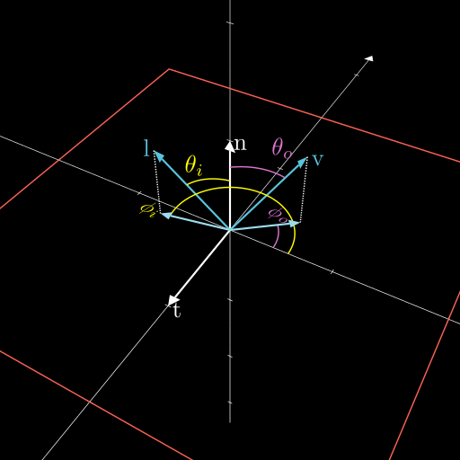

# 从零开始的渲染引擎-Aurora Chapter 0 基于物理的着色 Physically Based Shading

> Let the form of an object be what it may, --light, shade and perspective will always make it beautiful. *--John Constable*

本文中未经考证的翻译将会用<u>下划线</u>标识，标出英文原文，并且在之后使用英文原文。

参考：
- *Real-time Rendering 4th Edition*
- Google [*Filament*](https://google.github.io/filament/Filament.html)

## <u>反射方程</u> Reflectance Equation

$$
L_o = \int_{\boldsymbol{l}\in\Omega} f(\boldsymbol{l}, \boldsymbol{v})L_i(\boldsymbol{p}, \boldsymbol{l})(\boldsymbol{n} \cdot \boldsymbol{l}) dl
$$

其中
- $L_o$ 表示在一个点上的辐射率，也就是不同波长的光的亮度。在实际渲染中，因为我们使用RGB颜色来模拟光波长的分布，因此这个值也可以当成是这个点的颜色。
- $f$ 即为双向反射分布函数(BRDF)，它描述了对于不同波长的光，这个点可以反射多少，当然实际渲染也是取颜色。
- $L_i$ 表示输入光

当入射光向量 $\boldsymbol{l}$ 在这个半球上面扫一遍，积出来的值，就是最终结果。

为了求解，这个方程需要被转化成用 $\phi$ 和 $\theta$ 的形式，也就是使用立体角的微分的形式替代向量的微分。

$$
L_o(\theta_o, \phi_o) = \int_{\phi_i=0}^{2\pi} f(\phi_i, \theta_i, \phi_o, \theta_o)L(\phi_i, \theta_i)\cos \theta_i \sin \theta_i d\theta_i d\phi_i
$$

### 立体角

图中蓝色区域即为立体角，可以用这块区域的面积除以半径的平方得到。

$$
d\Omega = \frac{dA}{r^2}
$$

同样的，我们还可以用 $\theta$ 表示仰角 $\phi$ 表示方位角。也就是用蓝色区域的"宽"乘以"高"。

宽，$BC$ 弧，长度为 $d\phi * BF$ ，因为$BF = r\sin\theta$，所以 $BC = rd\phi\sin\theta$ （别忘了 $\theta$ 是法线到 $OB$ 的夹角！不是 $OB$ 和 $xy$ 平面的夹角！）

高，$AB$ 弧，长度为 $rd\theta$

因此立体角可以表示为

$$
d\Omega = \frac{r\sin \theta d\phi * rd\theta}{r^2} = \sin \theta d\phi d\theta
$$

所以上面Reflectance Equation里面，$dl$ 就被这一坨（懒得打）代替了，然后又因为这里都是单位向量和单位球，因此 $\boldsymbol{n}\cdot\boldsymbol{l}$ 就被 $\cos\theta_i$ 代替了。

## 双向反射分布函数 Bidirectional Reflectance Distribution Equation (BRDF)

先随便举个BRDF吧

$$
f(\boldsymbol{l},\boldsymbol{v})_{Lambertian} = \frac{\rho_{ss}}{\pi}
$$

其中
- $\rho_{ss}$ 表示漫反射的颜色

如果你有实现过Lambert光照模型（总该实现过吧，要不然直接看PBR有点猛的），那么你应该知道，在这个模型下，$L_o = \rho_{ss}L_i\boldsymbol{n}\cdot\boldsymbol{l}$ ，但它还可以表示为

$$
L_o = \int_{\boldsymbol{l}\in\Omega} \frac{\rho_{ss}}{\pi}L_i(\boldsymbol{p}, \boldsymbol{l})(\boldsymbol{n} \cdot \boldsymbol{l}) dl
$$

哎！是不是这个陌生的方程突然就有点眼熟了，它还可以变成

$$
L_o = \pi * \frac{\rho_ss}{\pi} L_i (\boldsymbol{n}\cdot\boldsymbol{l}) = \rho_{ss}L_i\boldsymbol{n}\cdot\boldsymbol{l}
$$

那你应该还知道，有Blinn-Phong模型提供高光反射的计算，这里不展开了。所以你应该猜到了，BRDF其实是一个由多个函数，比如漫反射函数，高光反射等，定义的函数，它可以决定反射出来的光的颜色（实际上是光在每段波长上面的亮度）。

## 微表面理论 Microfacet Theory

目前，大部分的BRDF模型都基于这个理论。

正如它的名字，微表面理论就是认为，一个宏观的平面实际上是由很多小的平面组成的。它们有各种各样的*法线*，对入射光进行*反射*和*遮挡*为了描述这个表面，让我们再引入几个函数：

- 法线分布函数(NDF) $D(\boldsymbol{m})$ 它可以表示在这个平面上的法线方向的分布
- 遮挡函数 $G(\boldsymbol{m}, \boldsymbol{v})$ 它表示从 $\boldsymbol{v}$ 方向看下去，法线会被怎么遮挡

这里都是统计学上的，并不是真的每根法线怎么怎么朝向。

**注意了嗷，下面出现的一吨大佬提出来的奇妙函数，大部分都不用记**

还有一些为了计算方便的定义，都比较符合直觉：

对于每一根法线在单位平面上的积，应当是一整个单位平面：

$$
f_{m\in\Theta}D(\boldsymbol{m})(\boldsymbol{n}\cdot\boldsymbol{m})d\boldsymbol{m} = 1
$$

另外，视线在每个法线上的投影，应当等于视线在宏观平面上的投影

$$
f_{m\in\Theta}D(\boldsymbol{m})(\boldsymbol{v}\cdot\boldsymbol{m})d\boldsymbol{m} = \boldsymbol{v}\cdot\boldsymbol{n}
$$

这里都是一整个球的积分，因为微表面上的法线是可以和视线相反的。

接下来我们再引入遮挡函数，就可以得到我们可以看到的全部微表面。

$$
f_{\in\Theta}G_1(\boldsymbol{m},\boldsymbol{v})D(\boldsymbol{m})(\boldsymbol{v}\cdot\boldsymbol{m})^+d\boldsymbol{m} = \boldsymbol{v}\cdot\boldsymbol{m}
$$

加号角标同 `max(x, 0)` ，也就是保证这玩意是正的，或者说过滤掉负的，也就是看不见的。

这里面的 $G_1(\boldsymbol{m},\boldsymbol{v})$ 表示遮挡， 那么一整个 $G_1(\boldsymbol{m},\boldsymbol{v})D(\boldsymbol{m})$ 就叫 <u>可见法线的分布</u>(Distribution of Visible Normals)

遮挡函数可以是任意取的，在2014年Heitz的论文中，他提出了 Smith Masking Function

$$
G_1(\boldsymbol{m},\boldsymbol{v}) = \frac{\chi^+(\boldsymbol{m},\boldsymbol{v})}{1+\Lambda(\boldsymbol{v})}
$$

$$
\chi^+(\boldsymbol{x}) =
\left\{
    \begin{aligned}
        1, \mathrm{where} \ x > 0, \\
        0, \mathrm{where} \ x \le 0,
    \end{aligned}
\right.
$$

其中 $\Lambda$ 函数是一个和NDF配套的函数。

然而遮挡造成的影响既可以是对于视线向量来说的，也可以是光照方向来说的，也就是既可以表示我们看不见的，也可以表示光找不到的，因此我们将这二者都考虑进去，得到一个更完善的遮挡函数。也就是 <u>联合遮挡函数</u>(Joint Masking Function)

$$
G_2(\boldsymbol{l},\boldsymbol{v},\boldsymbol{m}) = G_1(\boldsymbol{v},\boldsymbol{m})G_1(\boldsymbol{l},\boldsymbol{m})
$$

显然，微表面的高度也会影响它被遮挡的概率，如果我们只考虑微表面有不同高度，就得到了这个遮挡函数

$$
G_2(\boldsymbol{l},\boldsymbol{v},\boldsymbol{m}) = \lambda(\phi)G_1(\boldsymbol{v},\boldsymbol{m})G_1(\boldsymbol{l},\boldsymbol{m})+(1-\lambda(\phi))\min(G_1(\boldsymbol{v},\boldsymbol{m})G_1(\boldsymbol{l},\boldsymbol{m}))
$$

其中的 $\lambda(\phi)$ 是一个随着方位角 $\phi$ 增加而在 $[0,1]$ 范围内增加的函数
。比如可以是Ashikhmin等人提出的 $\lambda(\phi)=1-e^{-7.3\phi^2}$ ，或者是van Ginneken等人提出的 $\lambda(\phi)=\frac{4.41\phi}{4.41\phi+1}$

当我们同时考虑高度和法线，就可以得到最终的遮挡函数

$$
G_2(\boldsymbol{l},\boldsymbol{v},\boldsymbol{m}) = \frac{\chi^+(\boldsymbol{m}\cdot\boldsymbol{v})\chi^+(\boldsymbol{m}\cdot\boldsymbol{l})}{1+\Lambda(\boldsymbol{v})+\Lambda(\boldsymbol{l})}
$$

Heitz也提出了高度相关的遮挡函数

$$
G_2(\boldsymbol{l},\boldsymbol{v},\boldsymbol{m}) = \frac{\chi^+(\boldsymbol{m}\cdot\boldsymbol{v})\chi^+(\boldsymbol{m}\cdot\boldsymbol{l})}{1+\max(\Lambda(\boldsymbol{v}),\Lambda(\boldsymbol{l}))+\lambda(\boldsymbol{v},\boldsymbol{l})\min(\Lambda(\boldsymbol{v}),\Lambda(\boldsymbol{v}))}
$$

其中的 $\lambda$ 函数是个经验函数，比如

是时候来完善一下我们的微表面BRDF $f_\mu$ 了，它这时应当兼顾视线，光线的遮挡。

$$
f(\boldsymbol{l},\boldsymbol{v})=\int_{\boldsymbol{m}\in\Theta}f_\mu(\boldsymbol{l},\boldsymbol{v},\boldsymbol{m})G_2(\boldsymbol{l},\boldsymbol{v},\boldsymbol{m})D(\boldsymbol{m})\frac{(\boldsymbol{m}\cdot\boldsymbol{l})^+}{|\boldsymbol{n}\cdot\boldsymbol{l}|}\frac{(\boldsymbol{m}\cdot\boldsymbol{v})^+}{|\boldsymbol{n}\cdot\boldsymbol{v}|}d\boldsymbol{m}
$$

## 高光反射BRDF

